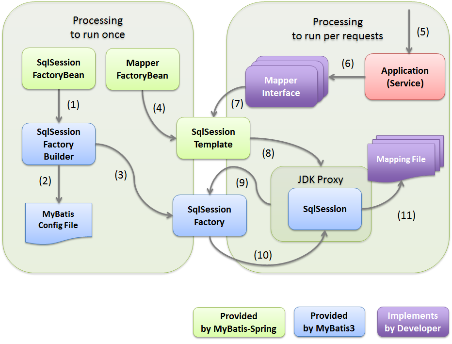

# MyBatis 第一天课堂笔记

学习过的持久层框架：`DBUtils, Hibernate`

Mybatis 就是类似于 `Hibernate` 的 `ORM` 持久层框架。

## 1 为什么学Mybatis?

### 1.1 目前最主流的持久层框架为 Hibernate 与 Mybatis，而且国内目前情况使用 Mybatis 的公司比 Hibernate 要多。

### 1.2 Hibernate 学习门槛不低，要精通门槛更高。

​	门槛高在怎么设计 O/R 映射，在性能和对象模型之间如何权衡取得平衡，以及怎样用好 Hibernate 缓存与数据加载策略方面需要你的经验和能力都很强才行。国内目前前的情况精通 Hibernate 技术大牛非常少。

### 1.3 SQL 优化方面。

​	Hibernate 的查询会将表中的所有字段查询出来，这一点会有性能消耗。当然了，Hibernate 也可以自己写 SQL 来指定需要查询的字段，但这样就破坏了Hibernate开发的简洁性。说得更深入一些，如果有个查询要关联多张表，比如5张表，10张表时，而且，我们要取的字段只是其中几张表的部分字段。这时用hibernate时就会显得非常力不从心。就算用 Hibernate 的 SQLQuery，后续的维护工作也会让人发狂。

### 2 JDBC编程回顾与存在的问题分析

### 2.1 开发步骤：

#### 2.1.1 导入数据脚本

在数据库 `MyBaits` 下创建今日学习用到的 `user` 和 `order` 两张表。

```sql
CREATE TABLE MyBaits.`order` (
	id int NOT NULL PRIMARY KEY,
	user_id int NOT NULL COMMENT '下单用户ID, [10000, 99999]',
	order_number varchar(50) NOT NULL COMMENT '订单号, Bitcon Address',
	createtime date NOT NULL COMMENT '创建订单时间',
	note varchar(100) NULL COMMENT '备注: $00.00',
	date_time time NOT NULL,
	CONSTRAINT FK_order_id FOREIGN KEY (user_id) REFERENCES mybaits.user (id)
);

CREATE INDEX FK_orders_1 ON MyBaits.`order` (user_id);

CREATE TABLE user (
	id INT,
	username VARCHAR(50),
	birthday DATE,
	sex VARCHAR(50),
	address VARCHAR(50)
);
```

数据由 `https://mockaroo.com/` 随机生成 2,000 条。

#### 2.1.2 创建工程，导入 `MySQL jar` 包

```powershell
.
├── lib
│   └── mysql-connector-java-5.1.7-bin.jar
└── web.xml
```

#### 2.1.3 编写程序

项目结构应如下所示：

```powershell
.
├── .idea
├── MyBaitsDemo.iml
├── src
│   └── com
│       └── lightwing
│           └── mybaits
│               └── jdbc
│                   └── JDBC_Test.java
└── web
    ├── .DS_Store
    ├── WEB-INF
    │   ├── lib
    │   │   └── mysql-connector-java-5.1.7-bin.jar
    │   └── web.xml
    └── index.jsp
```

### 2.2 JDBC 访问数据库的过程：

```java
package com.lightwing.mybaits.jdbc;

import com.mysql.jdbc.Connection;
import com.mysql.jdbc.PreparedStatement;

import java.sql.DriverManager;
import java.sql.ResultSet;
import java.sql.SQLException;

public class JDBC_Test {
    public static void main(String[] args) {
        Connection connection = null;
        PreparedStatement preparedStatement = null;
        ResultSet resultSet = null;

        try {
            // 1.加载数据库驱动
            Class.forName("com.mysql.jdbc.Driver");

            // 2.通过驱动管理类获取数据库链接
            connection = (Connection) DriverManager.getConnection(
                    "jdbc:mysql://localhost:3306/MyBaits?characterEncoding=utf-8",
                    "root",
                    "canton0520"
            );

            // 3.定义 SQL 语句 ?表示占位符
            String sql = "SELECT * FROM `user` WHERE id > ?";

            // 4.获取预处理statement
            preparedStatement = (PreparedStatement) connection.prepareStatement(sql);

            // 5.设置参数，第一个参数为 SQL 语句中参数的序号（从1开始），第二个参数为设置的参数值
            preparedStatement.setString(1, "0");

            // 6.向数据库发出 SQL 执行查询，查询出结果集 resultSet
            resultSet = preparedStatement.executeQuery();

            // 7. 遍历查询结果集
            while (resultSet.next()) {
                System.out.println(
                        "ID: " + resultSet.getString("id") +
                                ", Name: " + resultSet.getString("username") +
                                ", Birthday: " + resultSet.getString("birthday") +
                                ", Gender: " + resultSet.getString("sex") +
                                ", Address: " + resultSet.getString("address")
                );
            }
        } catch (Exception e) {
            e.printStackTrace();
        } finally {
            // 8.释放资源
            if (resultSet != null) {
                try {
                    resultSet.close();
                } catch (SQLException e) {
                    e.printStackTrace();
                }
            }
            if (preparedStatement != null) {
                try {
                    preparedStatement.close();
                } catch (SQLException e) {
                    e.printStackTrace();
                }
            }
            if (connection != null) {
                try {
                    connection.close();
                } catch (SQLException e) {
                    e.printStackTrace();
                }
            }
        }
    }
}
```

### 2.3 JDBC 存在的问题：

1. 频繁创建和打开、关闭数据连接，太消耗资源
2. SQL 语句存在硬编码，不利于维护
3. SQL 参数设置硬编码，不利于维护
4. 结果集获取与遍历复杂，存在硬编码，不利于维护，期望能够查询后返回一个 Java 对象

## 3 Mybatis 介绍

​	MyBatis 本是 Apache 的一个开源项目 iBatis, 2010年这个项目由 Apache Software Foundation 迁移到了Google Code，并且改名为 MyBatis。2013年11月迁移到Github。Mybatis 是面向 SQL 的持久层框架，他封装了 JDBC 访问数据库的过程，我们开发，只需专注于 SQL 语句本身的拼装，其它复杂的过程全部可以交给 Mybatis 去完成。

## 4 Mybaits 入门

### 4.1 需求列表

- 根据用户 ID 查询用户信息
- 根据用户名查找用户列表
- 添加用户
- 修改用户
- 删除用户

### 4.2 工程搭建

1. 导入依赖 jar 包，在课前资源中有

```powershell
.
├── asm-3.3.1.jar
├── cglib-2.2.2.jar
├── commons-logging-1.1.1.jar
├── javassist-3.17.1-GA.jar
├── log4j-1.2.17.jar
├── log4j-api-2.0-rc1.jar
├── log4j-core-2.0-rc1.jar
├── mybatis-3.2.7.jar
├── mysql-connector-java-5.1.7-bin.jar
├── slf4j-api-1.7.5.jar
└── slf4j-log4j12-1.7.5.jar
```

2. 配置 `SqlMapConfig.xml`，可参考课前资料

```xml
<?xml version="1.0" encoding="UTF-8" ?>
<!DOCTYPE configuration
        PUBLIC "-//mybatis.org//DTD Config 3.0//EN"
        "http://mybatis.org/dtd/mybatis-3-config.dtd">
<configuration>
    <!-- 和spring整合后 environments配置将废除 -->
    <environments default="development">
        <environment id="development">
            <!-- 使用jdbc事务管理 -->
            <transactionManager type="JDBC"/>
            <!-- 数据库连接池 -->
            <dataSource type="POOLED">
                <property name="driver" value="com.mysql.jdbc.Driver"/>
                <property name="url"
                          value="jdbc:mysql://localhost:3306/MyBaits?characterEncoding=utf-8"/>
                <property name="username" value="root"/>
                <property name="password" value="canton0520"/>
            </dataSource>
        </environment>
    </environments>
</configuration>
```

3. 配置 `log4j.properties`，可参考课前资料

```properties
# Global logging configuration
log4j.rootLogger=DEBUG, stdout
# Console output...
log4j.appender.stdout=org.apache.log4j.ConsoleAppender
log4j.appender.stdout.layout=org.apache.log4j.PatternLayout
log4j.appender.stdout.layout.ConversionPattern=%5p [%t] - %m%n
```

4. order 和 user 的实例化文件复制 pojo 到工程目录下

```java
package com.lightwing.mybaits.pojo;

import java.util.Date;

public class User {
    private Integer id;
    private String username;
    private String sex;
    private Date birthday;
    private String address;

    public Integer getId() {
        return id;
    }

    public void setId(Integer id) {
        this.id = id;
    }

    public String getUsername() {
        return username;
    }

    public void setUsername(String username) {
        this.username = username;
    }

    public String getSex() {
        return sex;
    }

    public void setSex(String sex) {
        this.sex = sex;
    }

    public Date getBirthday() {
        return birthday;
    }

    public void setBirthday(Date birthday) {
        this.birthday = birthday;
    }

    public String getAddress() {
        return address;
    }

    public void setAddress(String address) {
        this.address = address;
    }

    @Override
    public String toString() {
        return "User [id=" + id + ", username=" + username + ", sex=" + sex + ", birthday=" + birthday + ", address="
                + address + "]";
    }
}
```

```java
package com.lightwing.mybaits.pojo;

import java.util.Date;

public class Order {
    private Integer id;
    private Integer userId;
    private String order_number;
    private Date createtime;
    private String note;

    public Integer getId() {
        return id;
    }

    public void setId(Integer id) {
        this.id = id;
    }

    public Integer getUserId() {
        return userId;
    }

    public void setUserId(Integer userId) {
        this.userId = userId;
    }

    public String getNumber() {
        return order_number;
    }

    public void setNumber(String number) {
        this.order_number = number == null ? null : number.trim();
    }

    public Date getCreatetime() {
        return createtime;
    }

    public void setCreatetime(Date createtime) {
        this.createtime = createtime;
    }

    public String getNote() {
        return note;
    }

    public void setNote(String note) {
        this.note = note == null ? null : note.trim();
    }

    @Override
    public String toString() {
        return "Order [id=" + id + ", userId=" + userId + ", number=" + order_number + ", createtime=" +
                createtime
                + ", note=" + note + "]";
    }
}
```

5. 配置 SQL 查询的映射文件

```xml
<?xml version="1.0" encoding="UTF-8" ?>
<!DOCTYPE mapper
        PUBLIC "-//mybatis.org//DTD Mapper 3.0//EN"
        "http://mybatis.org/dtd/mybatis-3-mapper.dtd">
<mapper namespace="test">
</mapper>
```

6. 加载映射文件

```xml
<mappers>
    <mapper resource="config/MyBaits/User.xml"/>
</mappers>
```

### 4.3 完成需求

#### 4.3.1 需求完成步骤

1. 编写 SQL 语句

```sql
SELECT
    `id`,
    `username`,
    `sex`,
    `address`
FROM `user`
WHERE id > 10000 AND sex = 'F';
```

2. 配置 User 映射文件

3. 编写测试程序


  #### 4.3.2 根据用户 ID 查询用户信息

  ##### 4.3.2.1  映射文件与sql

```xml
    <select id="getUserById" parameterType="int"
            resultType="com.lightwing.mybaits.pojo.User">
        SELECT
            `id`,
            `username`,
            `sex`,
            `address`
        FROM `user`
        WHERE id = #{id1};
    </select>
```

##### 4.3.2.2  MyBatis 访问数据库代码

```java
public class MyBaitsTest {
    @Test
    public void testGetUserById() throws IOException {
        // 1.创建 SqlSessionFactoryBuilder 对象
        SqlSessionFactoryBuilder sfb = new SqlSessionFactoryBuilder();

        // 2.创建核心配置的输入流
        InputStream inputStream = Resources.getResourceAsStream("SqlMapConfig.xml");
        SqlSessionFactory sqlSessionFactory = sfb.build(inputStream);

        // 3.创建 SqlSession 对象
        SqlSession sqlSession = sqlSessionFactory.openSession();

        for (int i = 10000; i < 99999; i++) {
            // 4.执行查询
            User user = sqlSession.selectOne("user.getUserById", i);
            if (user != null)
                System.out.println(user);
        }

        // 5.释放资源
        sqlSession.close();
    }
}
```

#### 4.3.3 抽取 SqlSessionFactoryUtils 工具类，共享 SqlSessionFactory 创建过程

```java
public class SqlSessionFactoryUtils {
    private static SqlSessionFactory sqlSessionFactory;

    static {
        // 创建 SqlSessionFactoryBuilder 对象
        SqlSessionFactoryBuilder sfb = new SqlSessionFactoryBuilder();
        try {
            // 查找配置文件创建输入流
            InputStream inputStream = Resources.getResourceAsStream("SqlMapConfig.xml");
            // 加载配置文件，创建 SqlSessionFactory 对象
            sqlSessionFactory = sfb.build(inputStream);
        } catch (IOException e) {
            e.printStackTrace();
        }
    }

    /**
     * 获取单例 SqlSessionFactory
     *
     * @return
     */
    public static SqlSessionFactory getSqlSessionFactory() {
        return sqlSessionFactory;
    }
}
```

#### 4.3.4 根据用户名查找用户列表

##### 4.3.4.1 映射文件与 SQL

```xml
    <select id="getUserByName" parameterType="string"
            resultType="com.lightwing.mybaits.pojo.User">
        SELECT
            `id`,
            `username`,
            `birthday`,
            `sex`,
            `address` FROM `user`
        WHERE username LIKE '%${ value }%';
    </select>
```

##### 4.3.4.2 MyBatis 访问数据库代码

```java
@Test
public void getUserByName() throws IOException {
    SqlSessionFactory sqlSessionFactory = SqlSessionFactoryUtils.getSqlSessionFactory();
    SqlSession sqlSession = sqlSessionFactory.openSession();
    String name = "de";
    List<User> users = sqlSession.selectList("user.getUserByName", name);
    System.out.println("Result of users contains of: " + name);
    
    for (User user : users)
        System.out.println(user);
}
```

#### 4.3.5 添加用户

##### 4.3.5.1 映射文件与 SQL

```xml
<insert id="insertUser" parameterType="com.lightwing.mybaits.pojo.User">
	INSERT INTO `user` (id, username, address, sex, birthday)
	VALUES (#{ id }, #{ username }, #{ address }, #{ sex }, #{ birthday });
</insert>
```

##### 4.3.5.2 MyBatis 访问数据库代码

```sql
@Test
public void testInsertUser() throws IOException {
    // 1. 创建 SqlSession 对象
    SqlSession sqlSession = SqlSessionFactoryUtils.getSqlSessionFactory().openSession();
    User user = new User();
    user.setId(50821);
    user.setUsername("Nelson Englishby");
    user.setBirthday(new Date());
    user.setSex("M");
    user.setAddress("73 Delaware Place");
    // 2.执行插入
    sqlSession.insert("user.insertUser", user);
    // 3.提交事务
    sqlSession.commit();
    // 4.释放资源
    sqlSession.close();
}
```
##### 4.3.5.3 MySQL 自增返回


```xml
    <insert id="insertUserKey" parameterType="com.itheima.mybatis.pojo.User" useGeneratedKeys="true"
            keyProperty="id">
        INSERT INTO `user` (
            `username`,
            `birthday`,
            `sex`,
            `address`,
            `uuid2`)
        VALUES (
            #{ username }#,
            #{ birthday }#,
            #{ sex }#,
            #{ address }#,
            #{ uuid2 }#
        );
    </insert>
```

##### 4.3.5.4 MySQL 的 uuid 返回主键

注：在使用 uuid 之前数据库user表要先加上uuid2字段、user的pojo也要加上相应属性

```xml
    <!-- useGeneratedKeys:标识插入使用自增id
		 keyProperty:与useGeneratedKeys配套使用，用于绑定主键接收的pojo属性
	 -->
    <insert id="insertUserUUID" parameterType="com.lightwing.mybatis.pojo.User">
        <!-- selectKey:用于配置主键返回
             keyProperty：要绑定的pojo属性
             resultType:属性数据类型
             order:指定什么时候执行，BEFORE之前
        -->
        <selectKey keyProperty="uuid2" resultType="string" order="BEFORE">
            SELECT UUID()
        </selectKey>
        INSERT INTO `user` (
        `username`,
        `birthday`,
        `sex`,
        `address`,
        `uuid2`)
        VALUES (
        #{ username },
        #{ birthday },
        #{ sex },
        #{ address },
        #{ uuid2 }
        );
    </insert>
```

#### 4.3.6 修改用户

```xml
<update id="updateUser" parameterType="com.lightwing.mybaits.pojo.User">
	UPDATE `user` SET username = #{ username } WHERE id = #{ id };
</update>
```

#### 4.3.7 删除用户

```xml
<delete id="deleteUser" parameterType="int">
	DELETE FROM `user` WHERE id = #{ id1 }
</delete>
```

### 4.4 Mybatis 入门小结与 Mybatis 架构图



## 5 Mybatis Dao 开发方式

### 5.1 Dao 需求

- 根据用户 ID 查询用户信息

- 根据用户名查找用户列表
- 添加用户

### 5.2 原始 Dao 开发方法

#### 5.2.1 使用原有的 user 映射文件，不需修改

#### 5.2.2 新建个 UserDao 接口

```java
public interface UserDao {
    User getUserById(Integer id);

    List<User> getUserByUserName(String name);

    void insertUser(User user);
}
```
#### 5.2.3 新建个 UserDaoImpl 接口实现类

```java
public class UserDaoImpl implements UserDao {
    @Override
    public User getUserById(Integer id) {
        SqlSession sqlSession = SqlSessionFactoryUtils.getSqlSessionFactory().openSession();
        User user = sqlSession.selectOne("user.getUserById", id);
        sqlSession.close();
        return user;
    }

    @Override
    public List<User> getUserByUserName(String name) {
        SqlSession sqlSession = SqlSessionFactoryUtils.getSqlSessionFactory().openSession();
        List<User> list = sqlSession.selectList("user.getUserByName", name);
        sqlSession.close();
        return list;
    }

    @Override
    public void insertUser(User user) {
        SqlSession sqlSession = SqlSessionFactoryUtils.getSqlSessionFactory().openSession();
        sqlSession.insert("user.insertUser", user);
        sqlSession.commit();
        sqlSession.close();
    }
}
```

#### 5.2.4 使用 Dao 测试

```java
public class UserDaoTest {
    @Test
    public void testGetUserById() {
        UserDao userDao = new UserDaoImpl();
        User user = userDao.getUserById(10366);
        System.out.println(user);
    }

    @Test
    public void testGetUserByUserName() {
        UserDao userDao = new UserDaoImpl();
        List<User> list = userDao.getUserByUserName("Liang");
        for (User user : list)
            System.out.println(user);
    }

    public void testInsertUser() {
        UserDao userDao = new UserDaoImpl();
        User user = new User();
        user.setUsername("Lawson Liang");
        user.setAddress("Shenzhen");
        user.setBirthday(new Date());
        user.setSex("M");

        userDao.insertUser(user);
    }
}
```

### 5.3 官方推荐，接口动态代理

#### 5.3.1 动态代理 dao 开发规则

1. namespace 必需是接口的全路径名
2. 接口的方法名必需与映射文件的 SQL id 一致 
3. 接口的输入参数必需与映射文件的 `parameterType` 类型一致
4. 接口的返回类型必须与映射文件的 `resultType` 类型一致

#### 5.3.2 动态代理 dao 开发步骤

1. 创建 UserMapper.xml 映射文件(把原来的user.xml复制按开发规则要求修改一下)
2. 创建 UserMapper 接口(把原来的UserDao.java复制按开发规则要求修改一下)
3. 加载 UserMapper.xml
4. 测试动态代理 Dao

```java
public class UserMapperTest {
    @Test
    public void testGetUserById() {
        // 1.加载配置得到 SqlSession
        SqlSession sqlSession = SqlSessionFactoryUtils.getSqlSessionFactory().openSession();
        // 2.获取代理对象
        UserMapper userMapper = sqlSession.getMapper(UserMapper.class);
        // 3.查询数据
        User user = userMapper.getUserById(12998);
        System.out.println(user);
        // 4.关闭资源
        sqlSession.close();
    }

    @Test
    public void testGetUserByUserName() {
        SqlSession sqlSession = SqlSessionFactoryUtils.getSqlSessionFactory().openSession();
        // 1.获取代理对象
        UserMapper userMapper = sqlSession.getMapper(UserMapper.class);
        // 2.查询数据
        List<User> list = userMapper.getUserByName("Lo");
        for (User user : list) {
            System.out.println(user);
        }
        // 3.关闭资源
        sqlSession.close();
    }

    @Test
    public void testInsertUser() {
        SqlSession sqlSession = SqlSessionFactoryUtils.getSqlSessionFactory().openSession();
        UserMapper userMapper = sqlSession.getMapper(UserMapper.class);
        User user = new User();

        user.setUsername("Karen Cheung");
        user.setAddress("Shanghai");
        user.setBirthday(new Date());
        user.setSex("F");

        userMapper.insertUser(user);
        sqlSession.commit();
        sqlSession.close();
    }
}
```
## 6 SqlMapConf.xml配置

### 6.1 properties 

#### 6.1.1 属性核心文件配置

```xml
<!-- 加载规则，首先加载标签内部属性，再加载外部文件，名称相同时，会替换相同名称的内容 -->
<properties resource="jdbc.properties">
	<property name="jdbc.username" value="root"/>
	<property name="jdbc.password" value="canton0520"/>
</properties>
```

#### 6.1.2 jdbc.properties

```properties
jdbc.driver=com.mysql.jdbc.Driver
jdbc.url=jdbc:mysql://localhost:3306/MyBatis?characterEncoding=utf-8
jdbc.username=root
jdbc.password=canton0520
```

### 6.2 typeAliases

Mybatis 默认支持 Java 基本数据类型的别名识别详细参考教案。

自定义别名

```xml
<typeAliases>
		<!-- 单个别名定义 -->
		<!-- <typeAlias type="com.itheima.mybatis.pojo.User" alias="user"/> -->
		<!-- 别名包扫描器(推荐使用此方式)，整个包下的类都被定义别名，别名为类名，不区分大小写-->
		<package name="com.lightwing.mybatis.pojo"/>
</typeAliases>
```

### 6.3 mappers


```xml
<mappers>
	<!-- 第一种方式，加载 resource-->
	<mapper resource="mapper/user.xml"/>
	<!-- 第二种方式，class 扫描器要求：
		1、映射文件与接口同一目录下
		2、映射文件名必需与接口文件名称一致
	-->

	<!-- 第三种方式，包扫描器要求(推荐使用此方式)：
		1、映射文件与接口同一目录下
		2、映射文件名必需与接口文件名称一致
	-->
	<package name="com.lightwing.mybatis.mapper"/>
</mappers>
```


